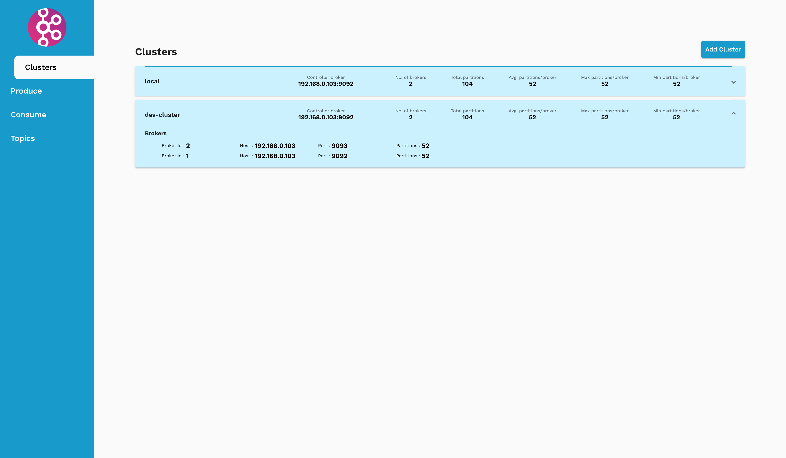
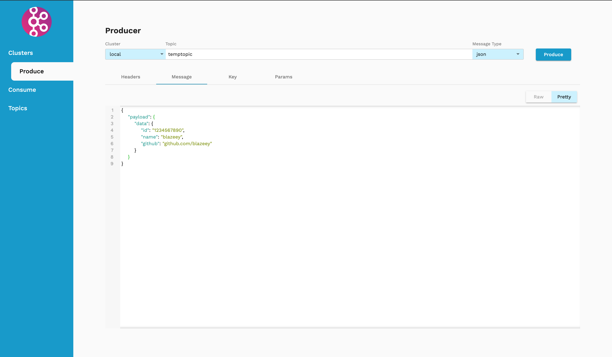
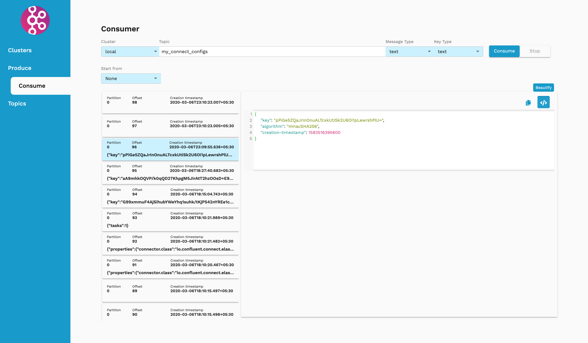
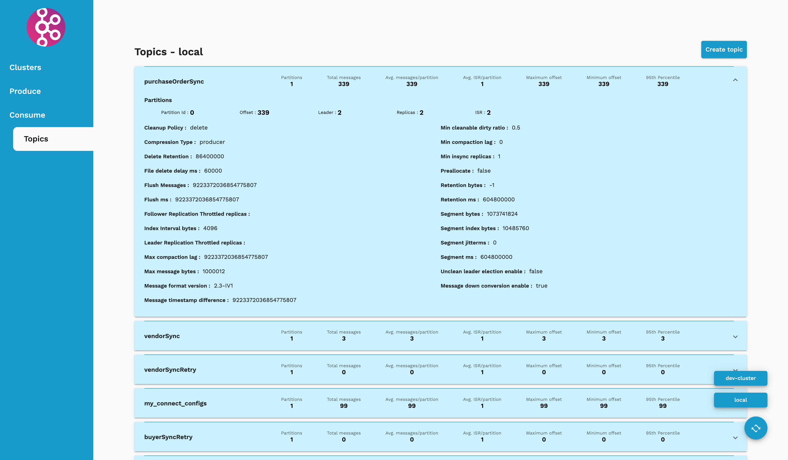

# Kafka-Man
## Postman for Kafka
KafkaMan is developed using Angular and Ruby on Rails. Why Angular and RoR? Just wanted to learn.

## Motivation
Well, got tired of using console to produce and consume messages. 

### Clusters

### Producer

### Consumer

### Topics

## Installation
- frontend/README.MD for Angular installation
- backend/README.MD for Ruby on Rails installation

## Docker
`docker run -itd -p 4200:80 blazeey/kafka-man:latest`

## Future Works
- Change UI - Suggestions are appreciated!
- Fix bugs. Too lazy to fix'em now :v
- Enabling SSL to connect to kafka. 
- New filters for consumers.
- Tabs for consumers and producers.
- Maintaining history of produced messages.

## Contribution
- Got new ideas? Shoot.
- Found bugs? Try fixing them if possible :p
- If too lazy like me to fix bugs, create a new issue. 
- Contributions are welcome! :))